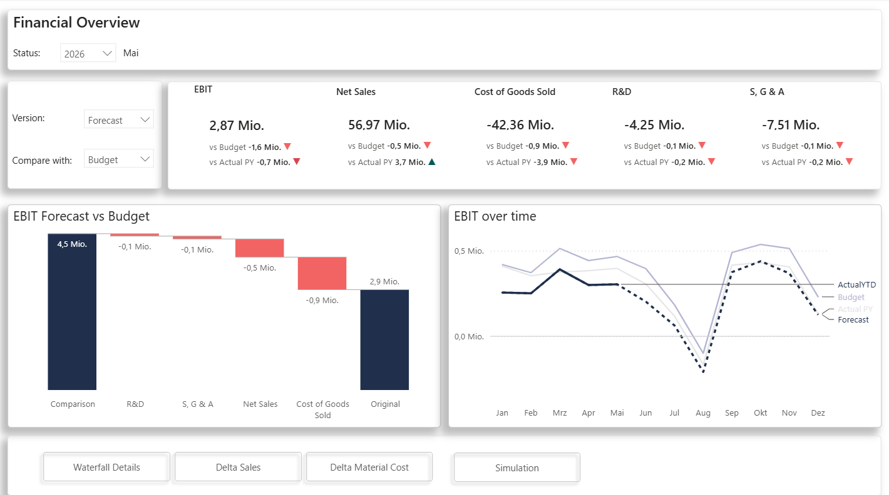
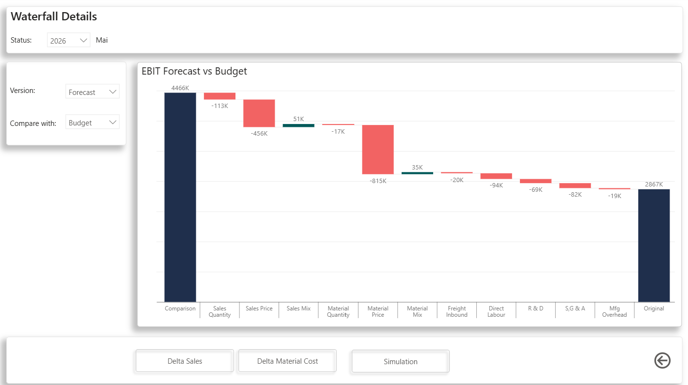
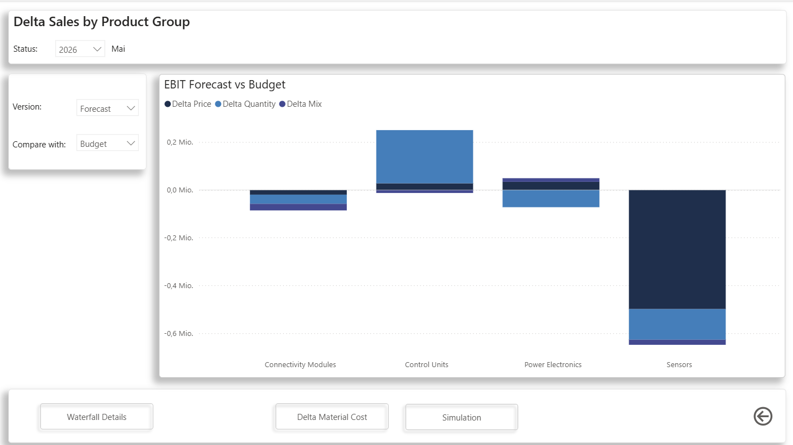
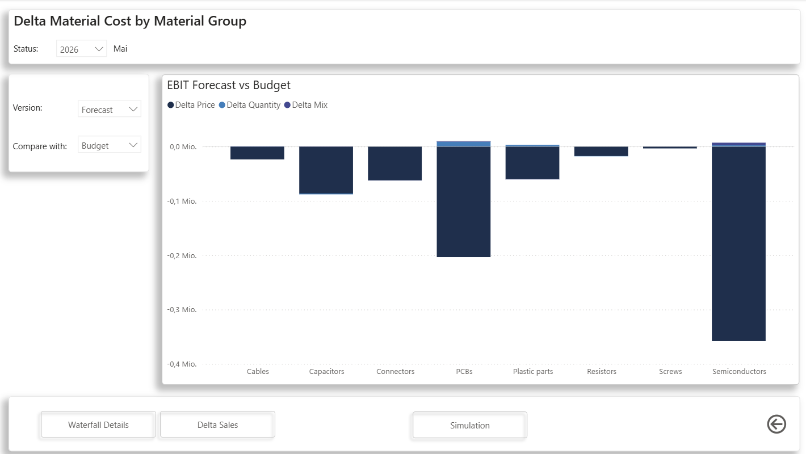
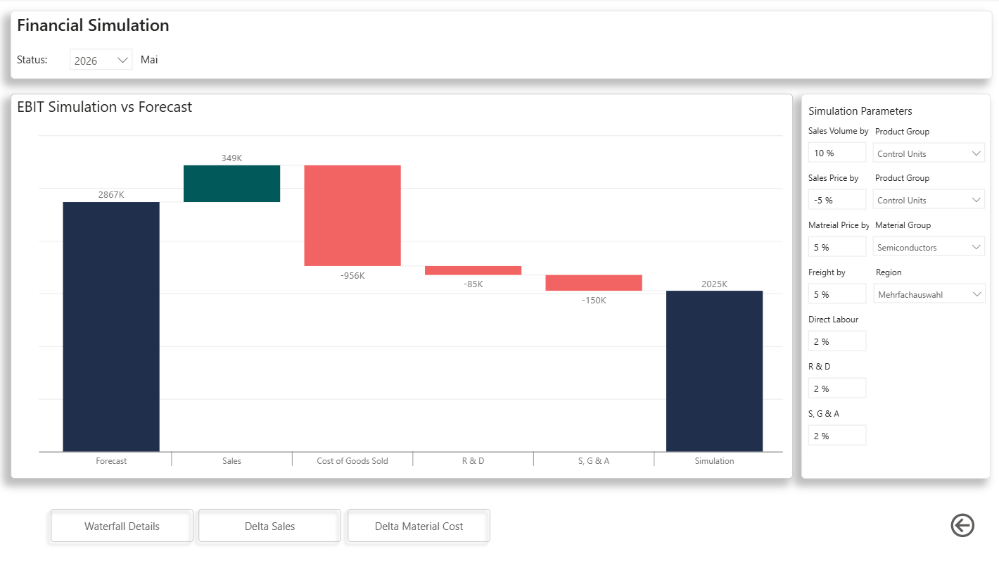
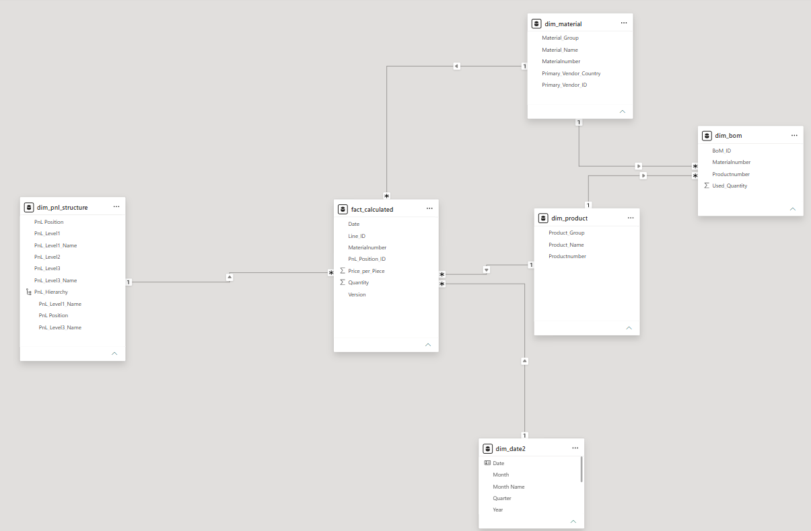

# Financial Overview and Simulation
A Power BI Project that allows not only data analysis, but also simulations

# Project Overview
- This Power BI report provides a comprehensive overview of key Profit & Loss (P&L) metrics.
- By integrating data from previously isolated sources, the dashboard enables detailed plan / actual analysis and supports transparent root-cause analysis.
- It also includes scenario analysis capabilities to simulate the EBIT impact resulting from changes in key business drivers such as sales, material cost, freight cost, direct labor and other significant factors.

# Business Questions
The report helps answer questions such as:
- Which products are responsible for the decline in revenue compared to the previous year?
- Are material cost variances versus budget driven by price or volume changes?
- What is the impact on EBIT if semiconductor material prices increase by x%?
- How would an increase of x% in freight cost for materials sourced from Asia affect EBIT?

# Dataset
This project is based on an anonymized and significantly reduced sample dataset created for demonstration purposes.  

Please note: due to an inconsistency in the dataset I received, the simulation shows a small delta in COGS even if all simulation parameters are set to 0. This is due to the fact that the used material quantity in the bill of material has decimals, but the material quantity in the fact table is an integer.

# Report
- Parameter-driven visualizations
- Interactive filtering and drill-down
- Custom DAX measures
- Synchronized slicers
- Interactive navigation

## Financial Overview
- Executive overview of key Profit & Loss KPIs
- Parameter-driven variance analysis (Actual YTD or Forecast vs Actual previous year or Budget) to facilitate root cause analysis of financial deviations
- Parameter-driven time-based visualization (can be selected to show EBIT, Net Sales, COGS, R & D, SG & A)

## Waterfall Details
- In-depth root cause analysis of financial deviations, 
- Volume-, price-, mix-variance analysis for Sales and Material cost

## Delta Sales by Product Group
Drill-down of Sales variances by product group / product and volume-, price-, mix-effect

## Delta Material by Material Group
Drill-down of Material cost variances by material group / material and volume-, price-, mix-effect

## Financial Simulation
EBIT scenario simulation using configurable business drivers

# Key KPIs
- EBIT
- Net Sales
- Cost of Goods Sold
- R & D Cost
- Sales, General & Admin Cost
- Delta Original vs Comparison (where Original and Comparison versions can be selected from different options)
- Delta Sales Quantity
- Delta Sales Price
- Delta Sales Mix 
...

# Technologies Used
- Power Query
- Power BI
- DAX

# Data Model

# DAX Examples

# Contact
LinkedIn: 
https://linkedin.com/in/tanja-brost-650528371

